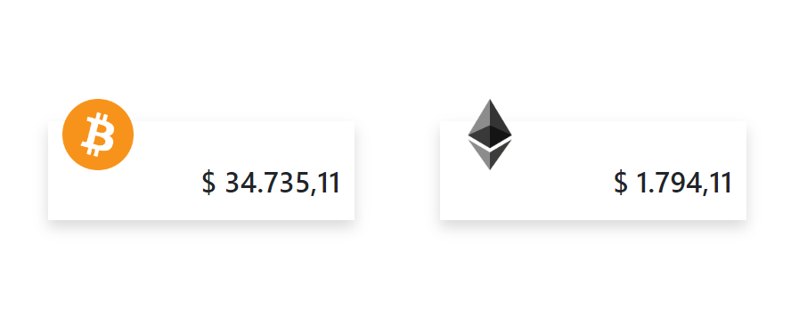

## Descripción

La dApp proporciona información en tiempo real sobre los precios de criptomonedas, como BTC/USD, ETH/USD y EUR/USD. Esta información se obtiene de manera confiable y precisa a través de la consulta a un oráculo de Chainlink, que está vinculado a un contrato inteligente en la red Ethereum.

**Nota:** La actual configuracion inicial es sobre testnet Goerli. Antes de deployar con el comando "migrate" configurar datos requeridos mas abajo y asegurarse que la cuenta con cual se hara la transaccion tenga fondos para pagar el gas.

Se utilizaron las siguientes tecnologias y librerias:

nodejs<br>
solidity<br>
truffle<br>
javascript<br>
html<br>
css<br>
bootstrap<br>
@chainlink/contracts<br>
@truffle/hdwallet-provider<br>

## Iniciar dApp

Instalar

```
  Ejecutar -> git clone https://github.com/feblesariel/Price_Feed.git
  Ejecutar -> npm install  
    
```
Configurar

```
  Configurar el archivo truffle-config.js (infura apikey, private key account y network).
  Configurar el archivo priceFeed.sol (addresses network).
  Ejecutar -> truffle console --network goerli
  Ejecutar -> migrate
  Configurar el archivo priceFeed.js (infura apikey, abi y direccion del contrato).  

```
Iniciar

```
  Correr servidor web index.html

```

## Licencia

Este proyecto está bajo la Licencia MIT.